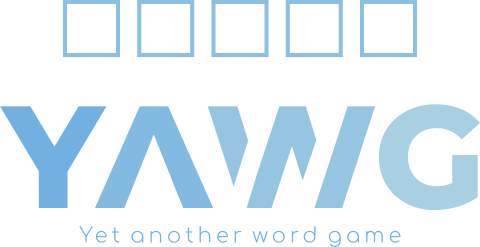
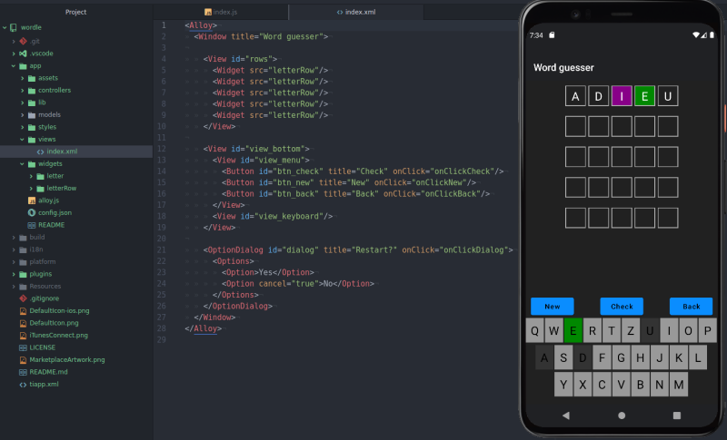

<center></center>

# Yet another word game - build with Appcelerator Titanium

Guess the 5-letter word in five tries. A wordle like app for Appcelerator Titanium



## Features

* word list (`/lib/words.js`) with 5 letter words (array for "words to guess" and "words to check")
* two languages: de and en
* light/dark mode
* letter turn animation
* start a new game with a new word
* easy to change keyboard layout: change the `keyboard` constant
* on-screen keyboard with letter feedback colors
* share squares

## 📲 How to install the app

A test version is available in the "Release" section

## 🛠 How to compile

### Appcelerator Titanium
The App is created with <a href="https://www.titaniumsdk.com/">Appcelerator Titanium</a>. In order to build the app you will need to install the toolchain first. Have a look at my <a href="https://github.com/m1ga/from_zero_to_app/blob/master/installation.md">installation tutorial</a> from <a href="https://github.com/m1ga/from_zero_to_app">From zero to app</a>.

### App

If you have the Titanium CLI installed you can build an Android app like this:

```bash
ti build -p android
```

#### App structure

App starts with `index` as a main view/controller. A row is inside the `letterRow` widget and the letters are in the `letter` widget. To add or remove guesses you can add/remove `letterRow` widgets from the `index.xml` view.<br/>
The wordlist is inside the `lib/words.js` file. There are two arrays: `wordList` and `checkWords` (currently in German). Words are randomly selected from `wordList`. The `checkWords` is used to check if the inserted word is a valid one.<br/>
If you want to change the language you can change the content of `lib/words.js`. If you want to play with longer or shorter words you have to change the `letterRow` widget and add/remove a `letter` widget there.

## Author
* Michael Gangolf (https://migaweb.de) <span class="badge-buymeacoffee"><a href="https://www.buymeacoffee.com/miga" title="donate"></a></span>
